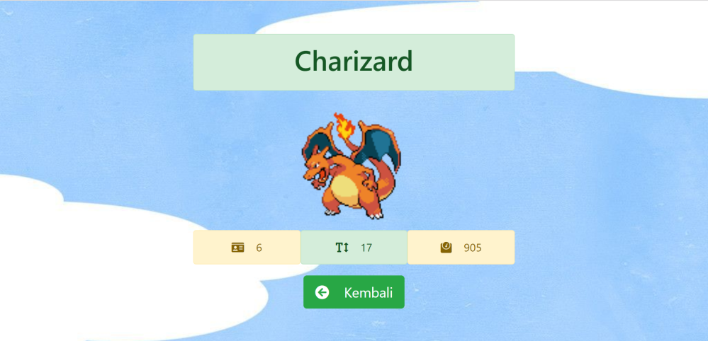

# Soal Ujian Python Data Science Fundamental


#

### **Soal 1 - Fungsi Pangkat**

Buatlah __sebuah return function__ dengan __2 parameter__ yang dapat menghitung pangkat tertentu dari sebuah bilangan, __tanpa__ menggunakan operator __pangkat ( ** )__ , tanpa menggunakan fungsi __pow( )__ dan tanpa memanfaatkan __package/library manapun!__

- __Case Flow__: Saat dieksekusi, program akan mencetak nilai return function.

    ```python
    print(pangkat(2, 2))
    print(pangkat(3, 3))
    print(pangkat(10, 5))
    ```

- Output yang diharapkan saat file diekseskusi via terminal:
  
    ```bash
    4
    27
    100000
    ```

- Contoh screenshot:

    

_**Catatan:**_ 

✅ Buatlah sebuah return function dengan 2 parameter: __pangkat(x, y)__

❌ Dilarang menggunakan operator pangkat ( __**__ )

❌ Dilarang menggunakan fungsi pangkat __*pow( )*__

❌ Dilarang menggunakan package manapun seperti: __Math__, __Numpy__, __PyPi__, dll.

✅ _Commit & push source code jawaban soal ini ke __Github__ Anda, buatlah repo dengan nama __Ujian_Fungsi_Pangkat__, kemudian lampirkan __url link repo Github__ Anda via email ke lintang@purwadhika.com!_

#

### **Soal 2 - Membalik Posisi Elemen List**

Buatlah __sebuah return function__ dengan __1 parameter__ yang dapat membalik urutan elemen dari suatu list. Misal terdapat suatu list: __[1,2,3,4,5]__ maka function yang Anda buat dapat membalik urutan elemen list menjadi: __[5,4,3,2,1]__. Namun Anda __dilarang keras__ untuk menggunakan cara-cara berikut:

⭐ __Cara 1.__ *menggunakan* __reverse( )__ *method pada list*
```python
a = [1, 2, 3, 4]
a.reverse()
print(a)

// hasil = [4, 3, 2, 1]
```

⭐ __Cara 2.__ *menggunakan* __list slicing__ *syntax* ( __[ : : -1]__ )
```python
b = [5, 6, 7, 8]
print(b[::-1])

// hasil = [8, 7, 6, 5]
```

⭐ __Cara 3:__ *menggunakan* __reversed( )__ *function*
```python
c = [9, 10, 11, 12]
print(list(reversed(c)))

// hasil = [12, 11, 10, 9]
```

#

- __Case Flow__: Saat dieksekusi, program akan mencetak nilai return function, yakni membalik posisi elemen dari list yang dimasukkan sebagai nilai parameter function, misal:

    ```python
    print(balikPosisi([1, 2, 3, 4, 5, 6, 7, 8, 9]))
    print(balikPosisi(['A', 'B', 'C', 'D', 'E', 'F', 'G']))
    print(balikPosisi(['Messi', 'Suarez', 'Coutinho', 'Dembele', 'Rakitic']))
    ```

- Output yang diharapkan saat file diekseskusi via terminal:
  
    ```bash
    [9, 8, 7, 6, 5, 4, 3, 2, 1]
    ['G', 'F', 'E', 'D', 'C', 'B', 'A']
    ['Rakitic', 'Dembele', 'Coutinho', 'Suarez', 'Messi']
    ```

- Contoh screenshot:

    

_**Catatan:**_ 

✅ Buatlah sebuah return function dengan 1 parameter: __balikPosisi(x)__

❌ Dilarang menggunakan __reverse( )__ list method

❌ Dilarang menggunakan __list slicing syntax [ : : -1]__

❌ Dilarang menggunakan __reversed( )__ function

✅ _Commit & push source code jawaban soal ini ke __Github__ Anda, buatlah repo dengan nama __Ujian_Balik_Elemen_List__, kemudian lampirkan __url link repo Github__ Anda via email ke lintang@purwadhika.com!_

#

### **Soal 3 - Cari Pokemon**

Buatlah sebuah __aplikasi Flask__ yang dapat memfasilitasi user untuk mencari data __Pokemon__ dengan nama tertentu, memanfaatkan __Poke API__ ([_klik sini_](https://pokeapi.co/)). API endpoint yang digunakan adalah __GET__ ke https://pokeapi.co/api/v2/pokemon/{nama_Pokemon}. Aplikasi yang dibuat harus memenuhi syarat minimal berikut:

1. Server aplikasi akan berjalan di __localhost:5000__ dan ketika user melakukan GET request via browser akan tampil sebuah halaman __HTML__ sederhana yang memuat 1 buah text input dan 1 buah button. Desain tampilan HTML tidak harus sama seperti contoh soal, utamakan fitur!

    

2. User dapat memasukkan nama Pokemon yang dicari ke dalam text input yang sudah disediakan. Saat user menekan tombol button, aplikasi akan mengambil data Pokemon yang dicari via Poke API: __GET__ ke https://pokeapi.co/api/v2/pokemon/{nama_Pokemon}.

    

3. Jika data ditemukan, maka user akan di-redirect ke __localhost:5000/hasil__ yang berisi halaman __HTML__, yang menampilkan data seputar Pokemon yang dicari. Data yang ditampilkan hanya: __nama Pokemon__, __gambar depan Pokemon__, __nomor id Pokemon__, __tinggi badan Pokemon__ & __berat badan Pokemon__. Desain tampilan HTML tidak harus sama seperti contoh soal, utamakan fitur!

    

4. Namun jika data tidak ditemukan atau tidak ada di dalam database Poke API, maka user akan di-redirect ke halaman __HTML__ yang memberikan informasi bahwa data tidak ditemukan. Desain tampilan HTML tidak harus sama seperti contoh soal, utamakan fitur!

    

_**Catatan:**_

⚠ Poke API memiliki batasan __100 API request per IP address per menit__. Jika Anda mengalami kendala dikarenakan telah mencapai limit, maka tunggulah sejenak beberapa menit, lalu coba call API kembali.

✅ _Commit & push source code jawaban soal ini ke __Github__ Anda, buatlah repo dengan nama __Ujian_Balik_Elemen_List__, kemudian lampirkan __url link repo Github__ Anda via email ke lintang@purwadhika.com!_

#

### *__#HappyCoding__* :relaxed:

#### Lintang Wisesa :love_letter: _lintangwisesa@ymail.com_

[Facebook](https://www.facebook.com/lintangbagus) | 
[Twitter](https://twitter.com/Lintang_Wisesa) |
[Google+](https://plus.google.com/u/0/+LintangWisesa1) |
[Youtube](https://www.youtube.com/user/lintangbagus) | 
:octocat: [GitHub](https://github.com/LintangWisesa) |
[Hackster](https://www.hackster.io/lintangwisesa)